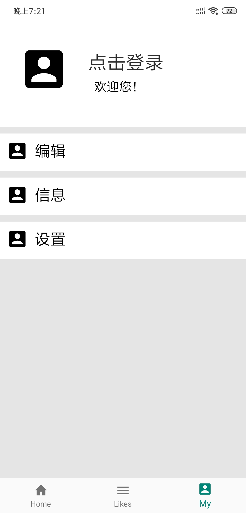
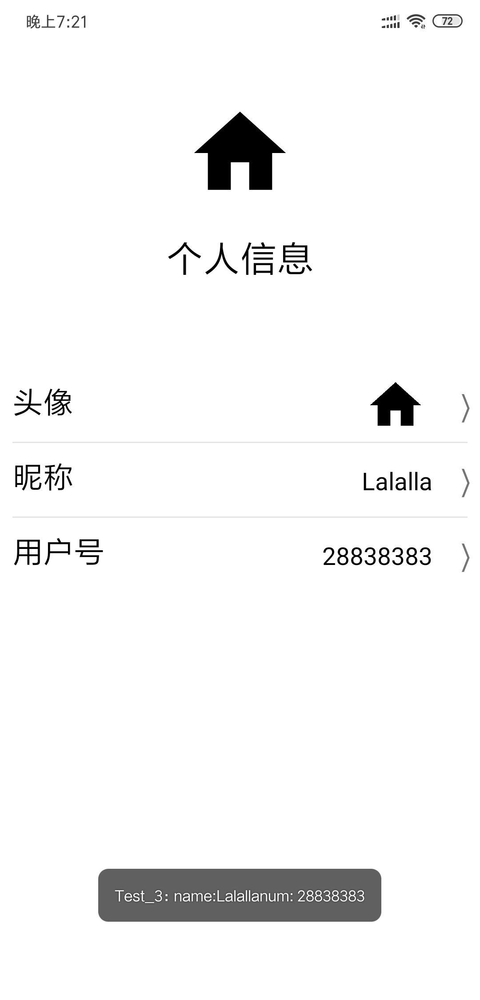

# 新闻或者BBS Android客户端

#### 1.基本实现了注册、登录功能，能够修改数据库中的用户名等信息。
#### 2.关于服务器端用php与数据库进行交互
#### 3.客户端与服务器之间传输信息是用的Volley框架
#### 4.界面的导航栏效果用的是[ImmersionBar](https://github.com/gyf-dev/ImmersionBar)
#### 5.实现了夜间模式，及两套不同的颜色
#### 6.包含检查更新功能
#### 7.用于测试调试的一些Toast信息没有去掉
#### 8.主界面还没有开始做

### Screenshots

